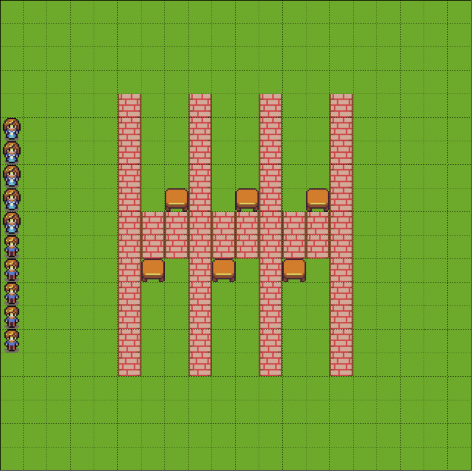

# projet-ia-jeux2020

Ce répertoire contient la description et le squelette du projet de l'UE AI et Jeux.

## Présentation générale du problème
Le projet s'inspire du Kolkata Paise Restaurant Problem, une variante du problème de minorité du [bar El Farol](https://en.wikipedia.org/wiki/El_Farol_Bar_problem).

Plusieurs joueurs (*n*), qui habitent dans le même quartier, souhaitent se rendre dans un des *k* restaurants du quartier. Une fois que leur choix est effectué, les joueurs se rendent dans le restaurant choisi.
La règle est alors la suivante :
* si un joueur est seul dans un restaurant, un plat lui est servi (gain = 1)
* si plusieurs joueurs se trouvent dans un même restaurant, un joueur est choisi au hasard (de manière uniforme parmi tous les joueurs présents dans ce restaurant), et est servi (gain = 1). Les autres joueurs ne sont pas servis (gain = 0).
Le jeu se déroule sur plusieurs itérations (*m*, fixé à l'avance).

## Réalisation attendue

### Une partie avec des stratégies de base
Dans le cadre de ce projet, nous vous demandons tout d'abord de partir du squelette et de la carte proposée. Cette carte comprend 6 restaurants, représentés par des pièces avec une table au fond, avec 20 joueurs (10 hommes, 10 femmes).
Elle est représentée ci-dessous:

Sur cette carte, fournie dans le squelette de code, les tables sont des objets ramassables, et elles représentent la case à atteindre pour les agents. Toutefois,  les joueurs ne les ramassent pas lorsqu'ils arrivent à destination. (Si cela vous amuse, vous pouvez faire en sorte que les joueurs s'arrêtent sur des cases différentes dans le restaurant, mais ce n'est pas important). Les joueurs sont placés au hasard sur la carte, et ils ne font que se déplacer au hasard. Ils ont donc peu de chance d'arriver à leur restaurant. Mais vous aller améliorer cela!

Le boucle principale devra être la suivante :
* à chaque itération, les joueurs apparaissent au hasard à une des positions de la carte;
* chaque joueur choisit un restaurant où se rendre, selon la stratégie qui est la sienne;
* chaque joueur se rend au restaurant de son choix, en suivant le plus court chemin jusqu'au restaurant (via l'exécution de l'algorithme A*);  
* lorsque tous les joueurs sont arrivés à destination, les joueurs obtiennent leur gain, et prennent connaissance des taux de remplissage de chaque restaurant.

**Note:** *Les collisions ne sont pas prises en compte (i.e. les joueurs peuvent partager la même case).*

Lorsque les *m* itérations sont réalisées, vous donnerez les scores réalisés par chaque joueur.
Vous pourrez donner les métriques suivantes:
* le score moyen de chaque joueur (ou stratégie)
* le produit des scores obtenus par chaque joueur utilisant une stratégie

Les deux stratégies de base qui doivent être implémentées pour cette version de base sont :
* une stratégie aléatoire uniforme
* une stratégie tétue (toujours choisir le même restaurant)

### Imaginez différentes stratégies

Libre à vous d'imaginer ensuite plusieurs stratégies et de les tester. La seule contrainte réside dans le fait que l'information disponible pour les agents est la fréquentation, à chaque tour, de chaque restaurant.

### Expérimentations
Le projet a pour ambition finale de comparer différentes stratégies. Pour cela, vous pourrez envisager des expérimentations dans lesquelles une moitié des agents adopte une stratégie, tandis qu'une autre moitié d'agents adopte une autre stratégie. Vous pourrez vous inspirer ici de ce qui est utilisé dans les approches de dilemme du prisonnier itéré.

## Pour aller plus loin
Quelques idées si vous souhaitez aller plus loin :
* réaliser d'autres expérimentations en faisant varier le nombre de restaurants et de joueurs. Les cartes sont réalisées avec l'éditeur de cartes [Tiled](https://www.mapeditor.org/), que vous pouvez utiliser pour réaliser vos propres cartes.
* tenir compte du temps de trajet
* changer les règles des gains (par exemple, que se passe-t-il si un restaurant ne sert le plat que si au moins deux personnes sont présentes?)
